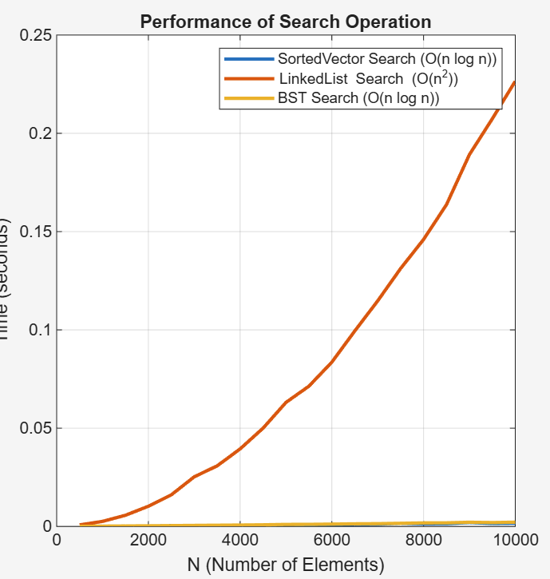
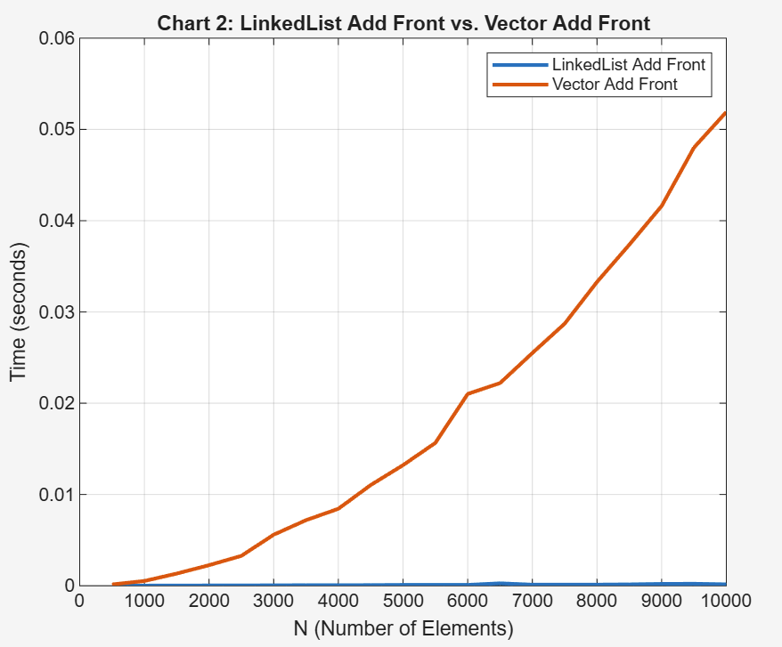
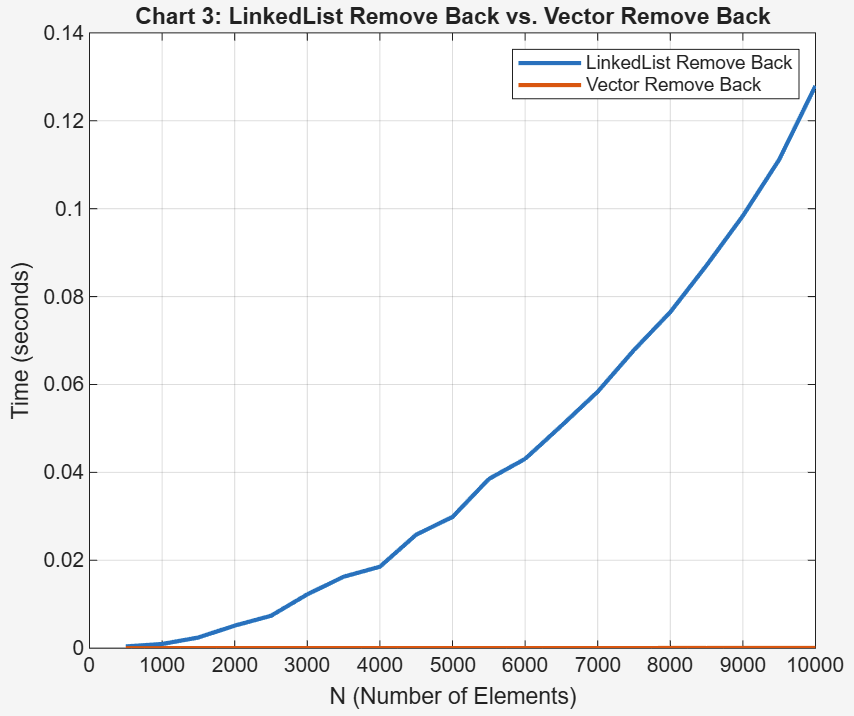

# Report for Data Structure Speed Comparison Homework

Make sure to answer every question in this homework. You should not bullet point your answers, but
instead write them as a full report format. This doesn't mean you have to be wordy, as concise is good,
but it does mean you need to use proper grammar, spelling, and be complete. For question that just
ask for a short answer, answer accordingly. Make sure to include references where appropriate.

## Algorithmic Analysis - Big $O$

Complete the Big O table below for the following functions. You may use any resource you like, but
for the SortedVector and SortedList, you should use the Big O for the functions you wrote in the
the homework. Both Single and Double Linked List you can assume head and tail pointers are available. 
Don't forget to use latex math notation (example in the table).

### Big $O$ Table

| -                         | Add/Insert | Remove | Search/Find | Sort   | Add Front | Add Back | Remove Front | Remove Back | Get by Index |
| ------------------------- | :---------: | :---------: | :---------: | :----------: | :-------: | :------: | :----------: | :---------: | :----------: |
| Vector                    |    $O(n)$   |    $O(n)$   |    $O(n)$   | $O(n\log n)$ |   $O(n)$  | $O(1)$ |    $O(n)$    |    $O(1)$   |    $O(1)$    |
| Single Linked List        |    $O(n)$   |    $O(n)$   |    $O(n)$   | $O(n\log n)$ |   $O(1)$  |  $O(n)$  |    $O(1)$    |    $O(n)$   |    $O(n)$    |
| Double Linked List        |    $O(n)$   |    $O(n)$   |    $O(n)$   | $O(n\log n)$ |   $O(1)$  |  $O(1)$  |    $O(1)$    |    $O(1)$   |    $O(n)$    |
| Sorted Vector             |    $O(n)$   |    $O(n)$   | $O(\log n)$ |    $O(1)$    |    ---    |    ---   |      ---     |     ---     |      ---     |
| Sorted Single Linked List |    $O(n)$   |    $O(n)$   |    $O(n)$   |    $O(1)$    |    ---    |    ---   |      ---     |     ---     |      ---     |
| Sorted Double Linked List |    $O(n)$   |    $O(n)$   |    $O(n)$   |    $O(1)$    |    ---    |    ---   |      ---     |     ---     |      ---     |
| Binary Search Tree        | $O(\log n)$ | $O(\log n)$ | $O(\log n)$ |    $O(1)$    |    ---    |    ---   |      ---     |     ---     |      ---     |


For Sort, we are asking for the Big $O$ for taking the current data structure and writing it 'sorted' to a file. However, not the file writes. For example, if you have a vector of 1000 elements, and you want to write it to a file, you would need to sort it first. So, the Big $O$ for this would be the Big $O$ for sorting. For BST, you have to convert the tree to a sequential structure, so the cost of doing that.  

### Assumptions with Sort

Since the worst case can change considerably based on what sort you use for sorting (if any), list each algorithm below, and specify the algorithm used in your assumption.  For BST, write which  method of traversal you would use to sort it.  

* Vector
   * Merge sort would bring the average time complexity and the worst case to $O(\log n)$, while Quick Sort is $O(n \log n)$ on average but has a $O(n^2)$ worst case. 
* Single Linked List
   * Merge Sort is the most efficient sorting algorithm for linked lists.  It does not rely on random access and has    an $O(n \log n)$ complexity.
* Double Linked List
   * Merge Sort is the most efficient sorting algorithm for linked lists.  It does not rely on random access and has    an $O(n \log n)$ complexity.   
* Sorted Vector - already sorted
   * The time complexity is $O(n)$ for iterating through the $n$ items to copy them.  
* Sorted Single Linked List - already sorted
   * The time complexity is $O(n)$ for iterating through the $n$ items to copy them.  
* Sorted Double Linked List - already sorted
   * The time complexity is $O(n)$ for iterating through the $n$ items to copy them.  
* Binary Search Tree
   *  In BST, we can use In-Order Traversal to iterate through the tree. BST will visit every node in its correctly    sorted order. BST will visit every node in its correctly sorted order.

### Worst Case vs. Average Case

There are a few functions whose worse case is very different than the average case. Name at least two of them, and explain why the worse case is so much worse than the average case. 

1. vector_add_back, Average Case: $O(1)$, the Worst Case is $O(n)$. In most situations, adding an element to the back of a vector is extremely fast. The function just places the new item at vector->movies[vector->size] and increments the size. This is a single $O(1)$ operation. The worst case happens only when the vector is full (when size == capacity). When this occurs, A new, larger block of memory must be allocated, and all $n$ existing elements must be copied from the old memory block to the new one, and the old memory block will be freed. 
2. bst_find. The Average Case is $O(\log n)$ and the Worst Case is $O(n)$. When the tree is balanced, every comparison allows you to discard roughly half of the remaining nodes. This brings the average time complexity to $O(\log n)$ while the worst case occurs when the tree becomes unbalanced. If the tree only has left/right branch, in this situation, the tree is more similar to a linked list and the time complexity of this is $O(n)$. 

## Empirical Analysis - Speed Comparison

For this section, you will need to have run the speed compare program and generated the output into a CSV file.

### Empirical Results Table

Add a link from this document to the CSV file you generated. The CSV file must have at least 15 different N values, but
often can have a lot more depending on what you ran.  

[results_10k.csv](results_10k.csv)
### Analysis

Create *at least three* graphics that each visually explain an aspect of your data related to an operation or data structure. Under each one, explain what the graphic is showing, and what you can conclude from it/what you find interesting about it.

> [!IMPORTANT]
> 
> Make sure you are comparing apples to apples and not apples to oranges when choosing what to put in the same graph. 
> 
> **:x: different data structures *and* different operations**
> 
> - Vector Add Front versus BST Add
> 
> **:white_check_mark: different operations *but* same data structure**
> 
> - BST Add versus Remove, and Search for BST
> 
> **:white_check_mark: different data structures *but* same operation**
> 
> - BST Add versus Add for Sorted Vector, and Sorted Single/Double Linked List
> 
> - Vector Add Front versus Add Front for Single/Double Linked List

> [!TIP]
> 
> To create the graphics you can use a third party program like Microsoft Excel or Google Sheets. (Completely optional if you want extra coding: you can use python libraries such as matplotlib, seaborn, or plotly)
> 
> Make sure you can see the image embedded in the Report.md using [image markdown] when you upload it to github, and get help if it doesn't show! 

#### Graphic 1 (Replace with a descriptive title)

> Time complexity comparison of search.
> 


#### Graphic 2 (Replace with a descriptive title)

> Time complexity comparison of add front.
> 

#### Graphic 3 (Replace with a descriptive title)

> Time complexity comparison of remove back
> 
## Critical Thought

### Data Evaluation

Answer the questions below. Make sure to answer each question fully, and explain your reasoning. Indent your answers immediately below the question, for it to line up with the bullet point.

For example:

```markdown
1. What is the most surprising result from the data? Why is it surprising?
   Answer here
```

1. What is the most surprising result from the data? Why is it surprising?

  I think the biggest surprise result from the data is that Vector Add Front is consistently faster than LinkedList Remove Back. Both big O time complexity are at $O(n^2)$, but when data set goes bigger, the time it consumes differes a lot(Linked List remove back consumes almost double amount of time that Linked List add front consumes. ) Despite having the same big O complexity.

2. What data structure is the fast at adding elements (sorted)? Why do you think that is?

  The Binary Search Tree is the fastest. This is because the total cost to add $N$ items to a balanced BST is $O(n \log n)$ (since each add operation is $O(\log n)$ on average). In contrast, both SortedVector and SortedList take $O(n^2)$ 
of time complexity. It needs $O(n)$ to find the right place to insert with a for loop and call __shift_right function on average of n times to move all elements to the right of the insertion point.

3. What data structure is the fastest at removing elements (sorted)? Why do you think that is?

  It is also the BST total cost to remove $N$ items to a balanced BST is $O(n \log n)$. The reason is the same as the last question. Both SortedVector and SortedList take $O(n^2)$ of time complexity. It needs $O(n)$ to find the right place to delete with a for loop and call __shift_left function on average of n times to move all elements to the left after deletion of the delete point.

4. What data structure is the fastest at searching? Why do you think that is?

  The SortedVector and BST are fastest, and both are dramatically faster than the LinkedList. This is because SortedVector uses a binary search ($O(\log n)$) and the BST uses a tree traversal (average $O(\log n)$), but the linked list must iterate through nodes one by one to search. 

5. What data structure is the fastest for adding elements to the front? Why do you think that is?

  The LinkedList is the fastest. ll_add_front creates one new node and updates the head pointer. Its time complexity is $O(1)$. In comparison, to add an element to a vector, we need to move every single existing element to make space, which brings the time complexity to O(n). 

6. What data structure is the fastest for adding elements to the back? Why do you think that is?

  Both LinkedList and Vector have time complexity of $O(1)$. They basically have the same time complexity but if the vector does not have enough space to store the new data, it has to create a new vector so the fastest data structure for all cases is the linked list. 

7. What data structure is the fastest for removing elements from the front? Why do you think that is?

  The LinkedList is the fastest. ll_remove_front is a $O(1)$ operation; it just advances the head pointer to the next node. while the vector must move every node forward by 1, making the time complexity to $o(n)$.

8. What data structure is the fastest for removing elements from the back? Why do you think that is?

  The vector is fastest in this case. The time complexity is $O(1)$. While the single linked list is $O(n) in this case, since it must traverse the entire list from the head just to find the second-to-last node.
  
### Deeper Thinking

#### Double Linked List vs Single Linked List

1. If you wrote your linked list as a single linked list, removing from the back was expensive. If you wrote it as a double linked list, removing from the back was cheap. Why do you think that is?

  The single-linked list must traverse the entire list from the head just to find the second-to-last node. For the double-linked list, it would have a previous pointer. It can be removed from the back by updating the previous pointer, making the time complexity to $O(1)$. 
  
2. When running most functions, at least ~30% of the tests were worse case scenarios. Why do you think that is? 

  #define SAMPLE_SPLIT .7 in the test.h. This function is called by search_movies and remove_tests. In 70% scenario, the while loop will be executed and this while loop guarantees that the movie we pick exists in the test sample, while 30% are picked randomly from the whole dataset, which makes this part have big chance that is not in the current test data pool. 

3. What was done in the code to encourage that? 

  For 70% cases, the function picks a random movie. If that movie's index is outside the range of movies currently in the data pool, it re-picks until it finds one that is inside the range.
For another 30%, this check is disabled. The function picks a random movie from the entire 10,000 movie list, but only 500 of them are in the current data pool, hence it has very large chance that the movie cannot be found in the current data pool. Since it cannot be found in the data, the program will iterate over all data in the pool and make the worst case with time complexity O(n). 

4. How did this particularly influence the linked list searches?

   It increases the total amount of time consumed for algorithms that require iteration over datasets. The function picks a random movie from the entire 10,000 movie list, but only 500 of them are in the current data pool, hence it has very big chance that the movie cannot be found in the current data pool. Since it cannot be found in the data, the program will iterate over all data in the pool and make the worst case with time complexity O(n). LinkedList Search was forced to do the maximum possible work ($O(n)$) on every single one of those miss operations, and makes the runtime of Linkedlist search closer to the worst case. 


#### Test Bias

1. The tests were inherently biased towards the BST to perform better due the setup of the experiment. Explain why this is the case.  (hint: think about the randomization of the data, and the worst case scenario for BST).

  This program uses a highly randomized data sample. It is the best-case scenario for BST. It naturally tends to create a balanced tree. It allows the BST to approach the best scenario $O(\log n)$ for add/search/remove. 
  
2. What would generate the worst case scenery for a BST?

  The worst case of BST is well sorted-list. At this case, the tree would act like a sorted linked list. The time complexity of add/search/remove would be as same as a linked-list($O(n)$). 

3. Researching beyond the module, how would one fix a BST so the worst case scenario matches (or at least i closer to) the average case.[^1^]

  Self-balancing Binary Search Trees, such as AVL Trees and Red-Black Trees, are good in this situation. Take AVL tree as an example, if a well-sorted BST tree formed 
  e.g:
  
  1  (Height: 2)
  
   \
   
    2 (Height: 1)
    
     \
     
      3 (Height: 0)
      
The tree would count the left side of 1(Empty) with Height -1 and B with height 1, and the difference is 2 with violates the AVL role. The tree sees this imbalance at node "A" and performs left rotation and make the tree be balanced again.

     2  (Height: 1)
     
    / \
    
  1         3 (Height: 0)
 (H: 0)

## Scenario

Fill out the table below. This is a common technical interview topic!

| Structure          | Good to use when                                                                 | Bad to use when                                                                  |
| ------------------ | -------------------------------------------------------------------------------- | -------------------------------------------------------------------------------- |
| Vector             | Data size is known or changes infrequently and needs fast random access.         | Need frequent insertions or deletions near the front or middle of the sequence.  |
| Linked List        | Good for stacks with frequent front only access                                  | When we need frequent random access                                              |
| Sorted Vector      | When values coming in are already mostly sorted, or need quick search access.    | When space is limited and the dataset is extremely large causing memory to swap. |
| Sorted Linked List | When we must keep data sorted with many insertions/deletions                     | When we need frequent random access                                              |
| BST                | When we need fast search/insert/delete                                           | data is presorted                                                                |
 
## Conclusion

Summarize your findings. Where there any surprises?  What did you end up learning by comparing speeds?
  
  Vector is best for Random access and add contents at the back(If there is enough storage left). The time complexity is $O(1)$ at this case. Vector is not good for insert/delete at Front/Middle as the time complexity is approaching to O(n).
  (Single) Linked List is best for front insertions, with time complexity of $O(1). While it is worst for random access and back removals with time complexity of $O(n)$.
  Binary search tree is best for an unsorted, balanced dataset. If the tree is balanced, the time complexity of adding, removing, and searching is $O(n \log n)$. If the data is presorted, it would be like a linked list with the time complexity of $O(n^2)$ for adding, removing, and searching. It surprised me because the tree works better when the dataset is not sorted. It is not intuitive. 
  

## Technical Interview Practice Questions

For both these questions, are you are free to use what you did as the last section on the team activities/answered as a group, or you can use a different question.

1. Select one technical interview question (this module or previous) from the [technical interview list](https://github.com/CS5008-khoury/Resources/blob/main/TechInterviewQuestions.md) below and answer it in a few sentences. You can use any resource you like to answer the question.

2. Select one coding question (this module or previous) from the [coding practice repository](https://github.com/CS5008-khoury/Resources/blob/main/LeetCodePractice.md) and include a c file with that code with your submission. Make sure to add comments on what you learned, and if you compared your solution with others. 

## References

Add your references here. A good reference includes an inline citation, such as [1] , and then down in your references section, you include the full details of the reference. Computer Science research often uses [IEEE] or [ACM Reference format].

[1] Reference info, date, etc.

[^1^]: Implementing a BST with a self-balancing algorithm, such as AVL or Red-Black Trees is a great research paper topic!

<!-- links moved to bottom for easier reading in plain text (btw, this a comment that doesn't show in the webpage generated-->

[image markdown]: https://docs.github.com/en/get-started/writing-on-github/getting-started-with-writing-and-formatting-on-github/basic-writing-and-formatting-syntax#images

[ACM Reference Format]: https://www.acm.org/publications/authors/reference-formatting
[IEEE]: https://www.ieee.org/content/dam/ieee-org/ieee/web/org/conferences/style_references_manual.pdf
